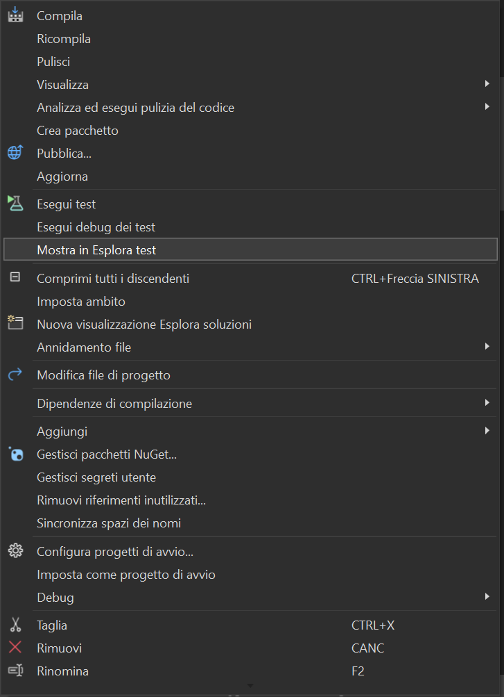
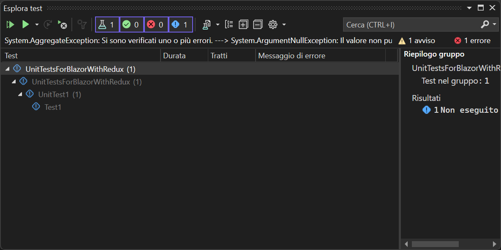
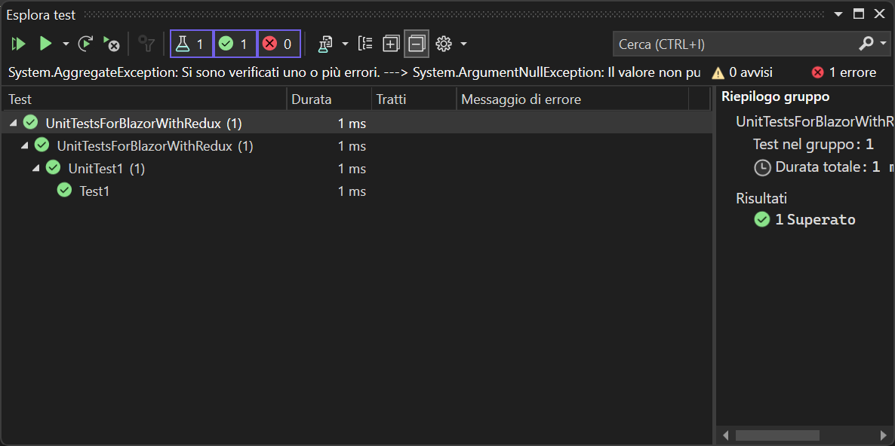
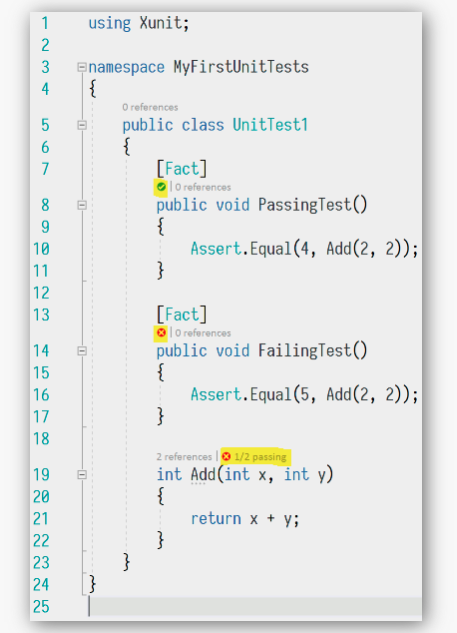
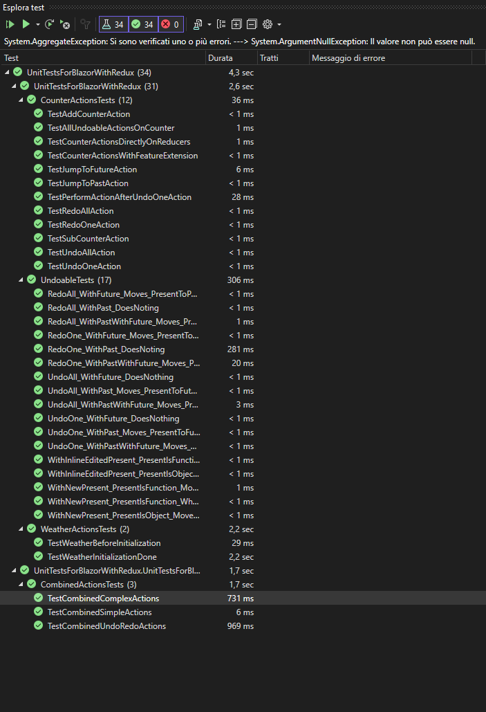

# Test a livello di actions - di interfaccia -> XUnit

# Reference

[Getting Started: .NET Core with Visual Studio](https://xunit.net/docs/getting-started/netcore/visual-studio)

# How xUnit works?

## Test Explorer

While right clicking on the test project we can click “Show in Test Explorer”:



So, we should see this window opens where all the tests are displayed, since we have already created the project is simple to understand that we have only one automatically generated test which is calle `UnitTest1`.



Then if we click “Run”, the test will be executed and we will see the result in the Test Explorer window.



So, now you can modify this test to tailor what you need to check by using `Assertion` mechanism as reported in the documentation:



## Facts vs Theories


> 🤩 ***Facts** are tests which are always true. They test invariant conditions.*

> 👨🏻‍🏫 ***Theories** are tests which are only true for a particular set of data.*

So, in practical point of view → Theories are used to make parametrized tests to test some *theories* related to a particular algorithm or functionality that we want to test in sense of correctness. For example, testing a method that returns if a number is odd or not can utilize this kind of tests, organized in a theory to test with several parameters this method.

```csharp
[Theory]
[InlineData(3)]
[InlineData(5)]
[InlineData(6)]
public void MyFirstTheory(int value)
{
    Assert.True(IsOdd(value));
}

bool IsOdd(int value)
{
    return value % 2 == 1;
}
```

Then in the test explorer we can see the *tree* of the call for the theory test:

# Integrate xUnit with [BlazorWithRedux](https://github.com/PedemonteGiacomo/BlazorWithRedux) project

There are two possibility to do this kind of tests:

- ***calling directly the reducers and get the state changed:***
    
    ```csharp
    public class CounterActionsTests
    {
    	[Fact]
    	public void TestCounterActionsDirectlyOnReducers()
    	{
    	
    	    var state = new UndoableCounterState();
    	    state.CreateInitialState();
    	    //use the extension method to create the initial state
    	
    	    var action1 = new AddCounter();
    	    var action2 = new AddCounter();
    	    var action3 = new AddCounter();
    	    var action4 = new SubCounter();
    	    var action5 = new UndoAction<UndoableCounterState>();
    	
    	    state = CounterReducers.OnAddCounter(state, action1);
    	    state = CounterReducers.OnAddCounter(state, action2);
    	    state = CounterReducers.OnAddCounter(state, action3);
    	    state = CounterReducers.OnSubtractCounter(state, action4);
    	    state = CounterReducers.ReduceUndoAction(state, action5);
    	
    	    state.Should().BeEquivalentTo(
    	    new UndoableCounterState
    	    {
    	        Past = new[]
    	        {
    	            new CounterState { Count = 0 },
    	            new CounterState { Count = 1 },
    	            new CounterState { Count = 2 },
    	        },
    	        Present = new CounterState { Count = 3 },
    	        Future = new[]
    	        {
    	            new CounterState { Count = 2 },
    	        },
    	    });
    	}
    }
    ```
    
    Obviously we can do better in terms of *spaghetti code* and doing something less readable but more efficient, since the reducer methods assume to receive certain type of action we can directly declared with the `new()` keyworkd directly inside the parameter:
    
    ```csharp
    state = CounterReducers.OnAddCounter(state, new());
    state = CounterReducers.OnAddCounter(state, new());
    state = CounterReducers.OnAddCounter(state, new());
    state = CounterReducers.OnSubtractCounter(state, new());
    state = CounterReducers.ReduceUndoAction(state, new());
    ```
    
    A possible improving of this could be by extending the `CounterReducer` class to have a `Reduce` method that depending on the action call the correct Reducer method.
    
    ```csharp
    public static class CounterReducersExtensions
    {
        public static UndoableCounterState Reduce(this CounterReducers counterReducers, UndoableCounterState state, object action)
        {
            switch (action)
            {
                case AddCounter addCounterAction:
                    return CounterReducers.OnAddCounter(state, addCounterAction);
                case SubCounter subCounterAction:
                    return CounterReducers.OnSubtractCounter(state, subCounterAction);
                case UndoAction<UndoableCounterState> undoAction:
                    return CounterReducers.ReduceUndoAction(state, undoAction);
                case RedoAction<UndoableCounterState> redoAction:
                    return CounterReducers.ReduceRedoAction(state, redoAction);
                case JumpAction<UndoableCounterState> jumpAction:
                    return CounterReducers.ReduceJumpAction(state, jumpAction);
                case UndoAllAction<UndoableCounterState> undoAllAction:
                    return CounterReducers.ReduceUndoAllAction(state, undoAllAction);
                case RedoAllAction<UndoableCounterState> redoAllAction:
                    return CounterReducers.ReduceRedoAllAction(state, redoAllAction);
                default:
                    throw new ArgumentException("Invalid action type", nameof(action));
            }
        }
    }
    ```
    
    So, usage in tests change like this:
    
    ```csharp
    var reducer = new CounterReducers();
    
    var actions = new object[]
    {
        new AddCounter(),
        new AddCounter(),
        new AddCounter(),
        new SubCounter(),
        new UndoAction<UndoableCounterState>()
    };
    
    foreach (var action in actions)
    {
        state = reducer.Reduce(state, action);
    }
    ```
    
- ***Extending the Feature to define methods that will call the reducer in the desired way*** (I think this could be interesting, depending on the kind of tests we need to perform, so depending also in what are the functionality to test → in the counter we can gain in avoiding redundancy by defining a method that depending on the value(positive or negative) will trigger the respecting reducer)
    
    First, change the State Feature to be the following, directly replacing the UndoableCounterState in the `CounterState.cs`:
    
    ```csharp
    [FeatureState(Name = "UndoableCounter", CreateInitialStateMethodName = nameof(CreateInitialState))]
    public sealed record UndoableCounterState : Undoable<UndoableCounterState, CounterState> {
        public static UndoableCounterState CreateInitialState() => new() { Present = new CounterState { Count = 0 } };
    
        public UndoableCounterState WithCounter(int count) { 
            if (count == 0) return this;
            if (count > 0) return CounterReducers.OnAddCounter(this, new());
            return CounterReducers.OnSubtractCounter(this, new());
        }
        
        /* this above could be done in a single line but decrease the readability:
    	  * public static UndoableCounterState WithCounter(this UndoableCounterState state, int count)
    		*	{
    		*	    return count == 0 ? state : count > 0 ? CounterReducers.OnAddCounter(state, new()) : CounterReducers.OnSubtractCounter(state, new());
    		*	}
        */
    }
    ```
    
    Or if you want to keep separated things, in the `CounterFeature.cs`:
    
    ```csharp
    public sealed class UndoableCounterFeature : Feature<UndoableCounterState>
    {
        public override string GetName() => nameof(CounterState);
    
        protected override UndoableCounterState GetInitialState() => new() { Present = new CounterState { Count = 0 } };
    
        public static UndoableCounterState CreateInitialState() => new() { Present = new CounterState { Count = 0 } };
    
        public static UndoableCounterState WithCounter(int count, UndoableCounterState state)
        {
            if (count == 0) return state;
            if (count > 0) return CounterReducers.OnAddCounter(state, new());
            return CounterReducers.OnSubtractCounter(state, new());
        }
    }
    ```
    
    Doing so, in the next part you need to pass always the state you want to update because we don’t have the reference to `this` as before since now this is the feature and not the state.
    
    Or even better, using ***ExtensionMethods:***
    
    Create the `UndoableCounterFeatureExtensions.cs`:
    
    ```csharp
    public static class UndoableCounterFeatureExtensions
    {
        public static UndoableCounterState CreateInitialState(this UndoableCounterState state)
        {
            return new UndoableCounterState { Present = new CounterState { Count = 0 } };
        }
    
        public static UndoableCounterState WithCounter(this UndoableCounterState state, int count)
        {
            if (count == 0) return state;
            if (count > 0) return CounterReducers.OnAddCounter(state, new());
            return CounterReducers.OnSubtractCounter(state, new());
        }
    }
    ```
    
    Then, the `WithCounter` will manage the call to the reducer without passing throught the dispatcher that we assume works fine.
    
    ```csharp
    public class CounterActionsTests
    {
        [Fact]
        public void TestCounterActionsWithFeature()
        {
            var state = new UndoableCounterState() { Present = new CounterState { Count = 0 } };
            
            state = state
                        .WithCounter(1) // present count is 1
                        .WithCounter(1) // present count is 2
                        .WithCounter(1) // present count is 3
                        .WithCounter(-1) // present count is 2
                        .WithUndoOne(); // i'm going back, so, present count is 3
            
            state.Should().BeEquivalentTo(
            new UndoableCounterState
            {
                Past = new[]
                {
                new CounterState { Count = 0 },
                new CounterState { Count = 1 },
                new CounterState { Count = 2 },
                },
                Present = new CounterState { Count = 3 },
                Future = new[]
                {
                new CounterState { Count = 2 },
                },
            });
        }
    }
    ```
    
    Since this line is bad to see, and moreover is breaking ball because you need to always take care of the Present initialization since in the `Undoable` library is `required`, I change from this:
    
    ```csharp
    var state = new UndoableCounterState() { Present = new CounterState { Count = 0 } };
    ```
    
    To this simpler and more powerful expression:
    
    ```csharp
    var state = new UndoableCounterState();
    ```
    
    To obtain this I just have change the constructor to properly set the `required` property Present as reported in the following piece of code.
    
    ```csharp
    public sealed record UndoableCounterState : Undoable<UndoableCounterState, CounterState>
    {
        [SetsRequiredMembers]
        public UndoableCounterState() => Present = new CounterState { Count = 0 };
    }
    ```
    
    Then using the `CreateInitialState()` that is correctly implemented in the `ExtensionMethods` reported above.
    
    ```csharp
    state.CreateInitialState();
    ```
    
    To avoid of doing the following initialization of the state: 
    
    ```csharp
    var state = new UndoableCounterState();
    state.CreateInitialState();
    ```
    
    which is the same for all of the tests, we can use a **`fixture`** class that is called in this case `CounterTestsFixture.cs` in the following way
    
    ```csharp
    public class CounterTestsFixture
    {
        public UndoableCounterState state { get; set; }
    
        public CounterTestsFixture()
        {
            // Initialize the state here to avoid making the new instance of the state in the test be more heavy since we don't need anymore to set the Present property that in the Undoable library is required
            state = new UndoableCounterState();
            state.CreateInitialState();
        }
    }
    ```
    
    Then making the TestClass *extends* this class
    
    ```csharp
    public class CounterActionsTests(CounterTestsFixture fixture) : IClassFixture<CounterTestsFixture>
    {
        private readonly CounterTestsFixture _fixture = fixture;
        
        // rest of the code ...
    ```
    
    This uses the **primary constructor** concept introduced in *.Net 8* which make us avoid to have the constructor method that will  put content inside the `fixture` property.
    
    Then, we just need to call the `_fixture.state` ad the beging of the Test methods:
    
    ```csharp
    var state = _fixture.state;
    ```
    

## Comparing this two approaches

Performing the tests discussed above I see this difference in execution time, let’s dive in it:

The difference in execution time between the two test methods in `CounterActionsTests.cs` is likely due to *the way they are interacting with the CounterReducers and the state.*

**Using the `CounterFeatureExtension`**

In the first test method `TestCounterActionsDirectlyOnReducers`, created an array of actions and then looping through each action to reduce the state. 

This involves multiple calls to the Reduce method, each of which involves a switch statement to determine the type of action and the corresponding reducer method to call. 

This overhead of multiple method calls and type checking could be contributing to the longer execution time.

**Using the `CounterReducersExtension`**

On the other hand, in the second test method `TestCounterActionsWithFeatureExtension`, chained method calls to modify the state. 

This approach is more efficient because it avoids the overhead of the loop and the switch statement in the Reduce method. 

Each method call directly modifies the state without needing to check the type of action.

Since those above were the starting point for all the tests I will use from this moment the `CounterFeatureExtension` way to perform tests.

### What we want to reach out?

We want to test the state of the application after a certain number of actions are performed, so we want to check if the state is correctly updated after the action is performed.
Both for the `Counter` and the `Weather` feature.
This to understand if the logic of the application works fine (if `Reducers` perform well).
At the end we should have a situation like this:

]

---

# Weather Tests

## Implementation

Using FluentAssertion to check that the **state** *should be* like some other state.

Example on the **WeatherForecast** initialization:

```csharp
[Fact]
public void TestWeatherBeforeInitialization()
{

    var state = _fixture.state;

    state.Should().BeEquivalentTo(
       new UndoableWeatherState
       {
           Present = new WeatherState()
           {
               Initialized = false,
               Loading = false,
               Forecasts = Array.Empty<WeatherForecast>()
           }
       });
}
```

Using always the fixture as seen before to simplify and make the code reusable for the initialization of the state.

To obtain a simple method to call directly from the state, as seen above, I just used *extension methods:*

```csharp
public static UndoableWeatherState WithWeather(this UndoableWeatherState state, object action)
{
    switch (action) // This is the action that we are going to use to test the state
    {
        // Depending on the action type, we are going to call the respective reducer
        case WeatherSetForecastsAction setForecastsAction:
            return WeatherReducers.OnSetForecasts(state, setForecastsAction); // to reproduce the load effect we will call this reducer after the retrieving of the forecats is done
        case WeatherSetLoadingAction setLoadingAction:
            return WeatherReducers.OnSetLoading(state, setLoadingAction);
        case WeatherSetInitializedAction setInitializedAction:
            return WeatherReducers.OnSetInitialized(state);
        case WeatherLoadForecastsAction loadForecastsAction:
            return WithNewForecasts(state);
        case UndoAction<UndoableWeatherState> undoAction:
            return WeatherReducers.ReduceUndoAction(state, undoAction);
        case RedoAction<UndoableWeatherState> redoAction:
            return WeatherReducers.ReduceRedoAction(state, redoAction);
        case JumpAction<UndoableWeatherState> jumpAction:
            return WeatherReducers.ReduceJumpAction(state, jumpAction);
        case UndoAllAction<UndoableWeatherState> undoAllAction:
            return WeatherReducers.ReduceUndoAllAction(state, undoAllAction);
        case RedoAllAction<UndoableWeatherState> redoAllAction:
            return WeatherReducers.ReduceRedoAllAction(state, redoAllAction);
        default:
            throw new ArgumentException("Invalid action type", nameof(action));
    }
}
```

### Test the LoadForecast action which is the heavier

Reproduce the LoadForecasts action by implementing as ExtensionMethod of the Feature so we can directly call it from the state as seen above for the counter, the data are retrieved from:

[](https://api.jsonbin.io/v3/b/65f31dfe1f5677401f3d79f1)

This because our sample data are stored in Blazor WebAssembly and they are not directly accessible from the tests, moreover in this way I simulate a real interaction with a *fake API.*

To implement this I extended the state to work in way similar to the `EffectMethods` defined in the `WeatherEffects.cs` in the following way:

```csharp
// since now the json file is not in the project, we will use the jsonbin.io to retrieve the data
// the data are stored in a json file that is publicly available and start with **record** that contains the array
// so we need those classes to retrieve correctly the "dataset"
public class WeatherData
{
    public WeatherForecast[] Record { get; set; }
    public Metadata Metadata { get; set; }
}

public class Metadata
{
    public string Id { get; set; }
    public bool Private { get; set; }
    public DateTime CreatedAt { get; set; }
}

public static async Task LoadForecasts(this UndoableWeatherState state)
{
    HttpClient httpClient = new HttpClient();
    var response = await httpClient.GetFromJsonAsync<WeatherData>("https://api.jsonbin.io/v3/b/65f31dfe1f5677401f3d79f1");
    var forecasts_var = response?.Record; // Extract the forecasts from the JSON data
    if (forecasts_var != null)
    {
        var randomForecasts = GetRandomForecasts(forecasts_var); // Get a randomly set of forecasts
        forecasts = randomForecasts; 
    }
}

// return a state with the randomForecasts as the new forecasts
public static UndoableWeatherState WithNewForecasts(this UndoableWeatherState state)
{
    Task.Run(async () =>
    {
        await LoadForecasts(state);
        state = state.WithWeather(new WeatherSetForecastsAction(forecasts));
    }).Wait();

    return state;
}

private static WeatherForecast[] GetRandomForecasts(WeatherForecast[] forecasts)
{
    var random = new Random();
    var randomForecasts = forecasts.OrderBy(x => random.Next()).ToArray();
    return randomForecasts;
}
```

So in this way you should be able to correctly test the WeatherForecast loading:

```csharp
// inside another Test method ...

var action2 = new WeatherLoadForecastsAction();
state = state.WithWeather(action2);

// so the forecasts should be not empty
state.Present.Forecasts.Should().NotBeEmpty(); //!!!
var forecasts = state.Present.Forecasts;

var action3 = new WeatherSetLoadingAction(false);
state = state.WithWeather(action3);

var action4 = new WeatherSetInitializedAction();
state = state.WithWeather(action4);

// the following method to check if the state is updated is the simplest one
// we can also check the state of the forecasts, but this is enough for now.
// This, since the forecasts randomly changes.
state.Should().NotBeEquivalentTo(
   new UndoableWeatherState
   {
       Present = new WeatherState()
       {
           Initialized = false,
           Loading = false,
           Forecasts = Array.Empty<WeatherForecast>()
       }
   });
// then check if the state is not loading anymore since it is initialized
state.Present.Initialized.Should().BeTrue();
state.Present.Loading.Should().BeFalse();

// now we can go back undoing actions
var action5 = new UndoAction<UndoableWeatherState>();
state = state.WithWeather(action5);

state.Should().BeEquivalentTo(
   new UndoableWeatherState
   {
       Past = new[]
       {
              new WeatherState()
              {
                Initialized = false,
                Loading = false,
                Forecasts = Array.Empty<WeatherForecast>()
              },
              new WeatherState()
              {
                    Initialized = false,
                    Loading = true,
                    Forecasts = Array.Empty<WeatherForecast>()
              },
              new WeatherState()
              {
                   Initialized = false,
                   Loading = true,
                   Forecasts = forecasts.ToArray()
              },
       },
       Present = new WeatherState()
       {
           Initialized = false,
           Loading = false,
           Forecasts = forecasts.ToArray()
       },
       Future = new[]
       {
            new WeatherState()
            {
               Initialized = true,
               Loading = false,
               Forecasts = forecasts.ToArray()
            }
       }
   });
   
// continue your test method...
```

# Final Conclusion

Succesfully tested both `Counter` and `Weather` usages and understand if the logic of the application works fine (if `Reducers` perform well).

***Performed also Combined tests to demostrate that the actions on different states are independent.***
